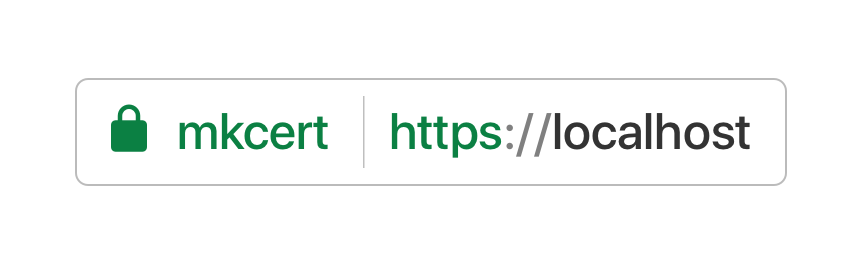
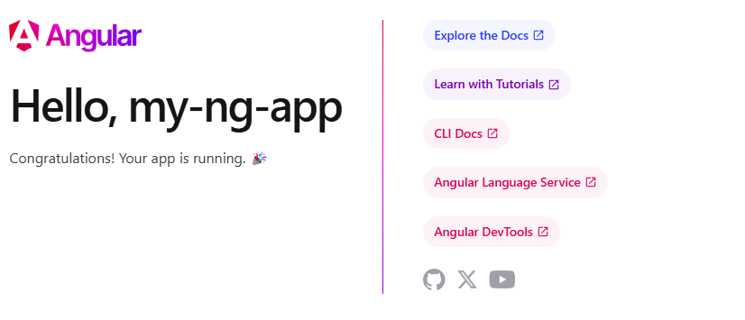
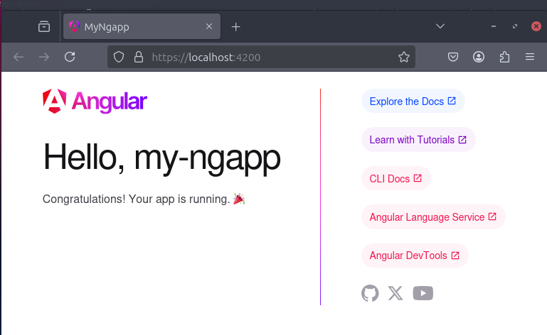

# Local SSL with `mkcert`

by Marcus Zou | 1 March 2025 | 3 minutes reading | 15 minutes practice



## Why mkcert.org?

TLS and SSL are vital for web security, but they're useless unless you have a trusted *root certificates* list. Root certificates identify who you trust unconditionally as well as who you trust to authenticate the legitimate owners of a website.

Modern browsers are making it easier to evaluate your list of trusted root certificate authorities. Yet, finding and maintaining this list for other non-browser tools can be a nightmare.

Projects like [certifi.io](http://certifi.io/) have taken steps towards making this easier by providing [Mozilla's list of trusted root certificates](https://hg.mozilla.org/mozilla-central/raw-file/tip/security/nss/lib/ckfw/builtins/certdata.txt) in a format that can be used by non-browser tools. However, it's far from perfect — it means you must trust everyone Mozilla trusts.

mkcert.org is the next step in letting you, not just Mozilla or other browser developers, decide who *you* trust. We focus on creating and maintaining methods for you to create your own custom list of root certificate authorities that *you* trust.


## Pre-requisites

Make some pre-requisites ready:

```shell
# Install common tools - Do Not install NodeJS/npm here as it's very low version.
sudo apt update && sudo apt upgrade -y
sudo apt install curl git htop nano net-tools wget tar unrar unzip zip tree -y
# Install NodeJS 20.x
sudo apt update
curl -fsSL https://deb.nodesource.com/setup_20.x | sudo -E bash -
sudo apt install -y nodejs
node --version
## v20.18.2
npm --version
## 10.8.2
```


## Create a simple Angular website

Install `Angular` for the web service:

```shell
# Update npm
sudo npm install -g npm@11.1.0
# Install Angular
sudo npm install -g @angular/cli@latest
```
```shell
## For macOS
brew install @angular/cli@latest
```

```shell
## For Windows
winget install nodejs-lts
winget install @angular/cli@latest
```

Create a Angular website:

```shell
ng new mkcert-ng-app
## Press: Y, N, Enter, N keys to create a simple Angular website
cd mkcert-ng-app
ng serve
## -> Local:  http://lolcahost:4200
## press h + enter to show help
```

Open the website: http://localhost:4200 as below:




## Install `mkcert` and Create the local CA

Install `mkcert` package:

```shell
## install pre-reuisites
sudo apt install libnss3-tools
## Install mkcert
sudo apt install mkcert

## for macOS
brew install mkcert

## For Windows
winget install mkcert
```

Then create the certificate and key:

```shell
## Create local RootCA at `mkcert-ng-app` folder
## For Linux
mkdir linux
cd linux
mkcert -install
mkcert localhost 127.0.0.1 ::1
cd ..

## for macOS
mkdir -p macbook
cd macbook
mkcert localhost 127.0.0.1 ::1
cd ..

## for Windows
mkdir windows
cd windows
mkcert localhost 127.0.0.1 ::1
cd ..

## Created a new certificate valid for the following names 📜
## - "localhost"
## - "127.0.0.1"
## - "::1"
##  The certificate is at "./localhost+2.pem" and the key at "./localhost+2-key.pem" ✅
##  It will expire on 1 June 2027 🗓
```


Then re-launch the website by adding the `RootCA`:

For Linux

```shell
ng serve --ssl --ssl-cert "./linux/localhost+2.pem" --ssl-key "./linux/localhost+2-key.pem" --no-hmr
```
For macOS
```shell
ng serve --ssl --ssl-cert "./macos/localhost+2.pem" --ssl-key "./macos/localhost+2-key.pem" --no-hmr
```

For Windows

```shell
ng serve --ssl --ssl-cert "windows\localhost+2.pem" --ssl-key "windows\localhost+2-key.pem" --no-hmr
```


Here is the SSL connection: https://localhost:4200




## End

